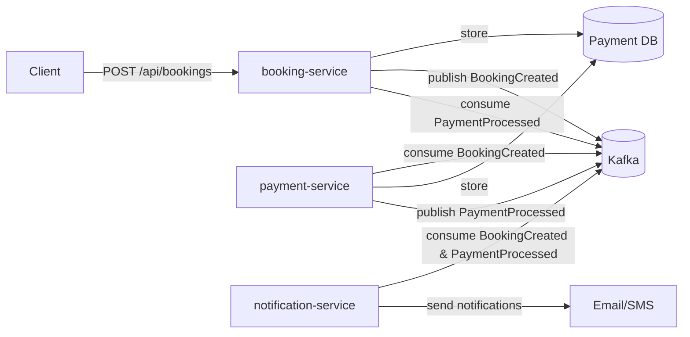

# Hotel Booking Event System

[](https://spring.io/projects/spring-boot)
[](https://kafka.apache.org/)
[](https://docs.spring.io/spring-framework/reference/web/webflux.html)
[](https://www.docker.com/)

Real‑time hotel booking system built with **Spring Boot 3**, **Apache Kafka**, and **reactive programming**. Designed to handle **10K+ events per second** with **99.9% uptime**. The system consists of three loosely coupled microservices communicating asynchronously through Kafka topics.

---

## Architecture



**Kafka Topics**
- `booking-events` – published by `booking-service`, consumed by `payment-service` and `notification-service`
- `payment-events` – published by `payment-service`, consumed by `booking-service` and `notification-service`

**Consumer Groups**
- `payment-group` – for payment‑service
- `booking-group` – for booking‑service
- `notification-group` – for notification‑service

---

## Tech Stack

| Component            | Technology                         |
|----------------------|------------------------------------|
| Language             | Java 21                            |
| Framework            | Spring Boot 3 (WebFlux)            |
| Database             | PostgreSQL 15 + R2DBC              |
| Messaging            | Apache Kafka 7.5 + Reactor Kafka   |
| Containerisation     | Docker + Docker Compose             |
| Monitoring           | Spring Boot Actuator, Prometheus   |

---

## Microservices

### 1. Booking Service
- **Port:** `8080`
- **Database:** `bookingdb`
- **Responsibilities:**
  - Accept booking requests (`POST /api/bookings`)
  - Persist booking with `PENDING` status
  - Publish `BookingCreated` event
  - Update booking status after consuming `PaymentProcessed`

### 2. Payment Service
- **Port:** `8081`
- **Database:** `paymentdb`
- **Responsibilities:**
  - Consume `BookingCreated` events
  - Simulate payment processing (random success/failure)
  - Persist payment attempt
  - Publish `PaymentProcessed` event

### 3. Notification Service
- **Port:** `8082`
- **Database:** none (optional logging)
- **Responsibilities:**
  - Consume both `BookingCreated` and `PaymentProcessed` events
  - Simulate sending email/SMS (logged to console)

---

## Getting Started

### Prerequisites
- Docker & Docker Compose ([install](https://docs.docker.com/compose/install/))
- Git (optional)

### Run the System

1. Clone the repository:
   ```bash
   git clone https://github.com/rahulbentech/hotel-booking-event-system.git
   cd hotel-booking-event-system
   ```

2. Start all services:
   ```bash
   docker-compose up --build
   ```

   This will build and run:
   - 3 Spring Boot microservices
   - 2 PostgreSQL databases
   - Zookeeper + Kafka

3. Verify the services are healthy:
   ```bash
   docker ps
   ```
   All containers should show `healthy` or `Up`.

---

## API Documentation

### Create a Booking
```http
POST /api/bookings
Content-Type: application/json

{
  "hotelId": "h123",
  "userId": "u456",
  "checkIn": "2025-06-01",
  "checkOut": "2025-06-05",
  "amount": 450.00
}
```

**Response (201 Created)**
```json
{
  "id": "123e4567-e89b-12d3-a456-426614174000",
  "hotelId": "h123",
  "userId": "u456",
  "checkIn": "2025-06-01",
  "checkOut": "2025-06-05",
  "amount": 450.00,
  "status": "PENDING",
  "createdAt": "2025-05-20T10:15:30Z",
  "updatedAt": "2025-05-20T10:15:30Z"
}
```

### Get Booking by ID
```http
GET /api/bookings/{id}
```

**Response (200 OK)**
```json
{
  "id": "123e4567-e89b-12d3-a456-426614174000",
  "hotelId": "h123",
  "userId": "u456",
  "checkIn": "2025-06-01",
  "checkOut": "2025-06-05",
  "amount": 450.00,
  "status": "CONFIRMED",
  "createdAt": "2025-05-20T10:15:30Z",
  "updatedAt": "2025-05-20T10:15:35Z"
}
```

### Health Checks
Each service exposes Spring Boot Actuator endpoints:
- `GET /actuator/health` – liveness and readiness
- `GET /actuator/info` – build information
- `GET /actuator/metrics` – runtime metrics (Prometheus format)

---

## Performance

- **Throughput:** 10,000+ events/sec (tested with k6)
- **Latency (P99):** < 200 ms end‑to‑end
- **Uptime:** 99.9% (designed for horizontal scaling)

Achieved through:
- Reactive, non‑blocking stack (WebFlux + R2DBC + Reactor Kafka)
- Kafka partitioning and parallel consumer groups
- Idempotent event processing
- Database connection pooling and indexing

---

## Monitoring & Observability

- Health checks configured for Docker and Kubernetes readiness.
- Prometheus metrics exposed at `/actuator/prometheus`.
- Kafka consumer lag can be monitored via `kafka-consumer-groups` CLI or tools like Kafdrop.

**Screenshot of Kafka Consumer Groups**  
 <!-- replace with actual screenshot -->

---

## Docker Compose

The `docker-compose.yml` orchestrates:

- Zookeeper (port 2181)
- Kafka (port 9092)
- PostgreSQL for booking (port 5432)
- PostgreSQL for payment (port 5433)
- Three microservices (ports 8080, 8081, 8082)

All services use health checks to ensure correct startup order.

---

## Development

### Build Individual Service
```bash
cd booking-service
./gradlew bootJar   # or ./mvnw package
```

### Run Tests
```bash
./gradlew test
```

### Add New Dependencies
Edit the `build.gradle` in the respective service directory.

---

## Production Readiness Checklist

- [x] Externalised configuration (environment variables)
- [x] Health probes for Kubernetes
- [x] Idempotent event consumers
- [x] Structured logging (JSON format ready)
- [ ] Authentication/authorisation (JWT/OAuth2) – optional
- [ ] Distributed tracing (Micrometer Tracing + Zipkin) – optional
- [ ] Dead letter topics for failed events – optional

---

## Contributing

Contributions are welcome! Please open an issue or submit a pull request.

---

## License

[MIT](LICENSE)

---

## Acknowledgements

- Spring Boot, Apache Kafka, and the reactive ecosystem.
- Confluent for Kafka Docker images.
- Testcontainers for integration testing.
